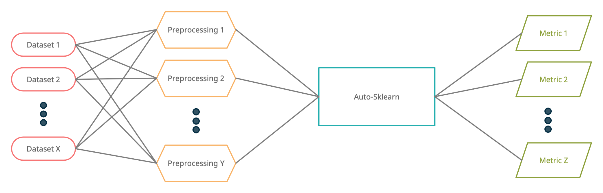
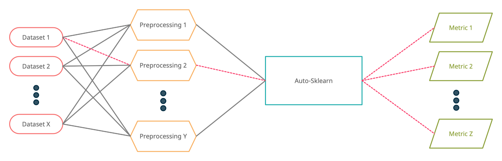
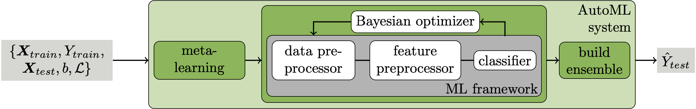

<!-- _paginate: false -->
<!-- _footer: Radovan Haluška &bull; rhaluska@cisco.com -->

# Data Preprocessing Strategies in Imbalanced Data Classification

## Q4 Research Review

---

# Experiment Setup



---

# Experiment Setup



---

# Imbalanced Datasets

 - [Credit Card Fraud Detection Dataset](https://www.kaggle.com/mlg-ulb/creditcardfraud) _~1:578_
 - [Asteroid Dataset](https://www.kaggle.com/sakhawat18/asteroid-dataset) _~1:454_
 - [Insurance Dataset](https://www.kaggle.com/arashnic/imbalanced-data-practice) _~1:5_
 - [Job Change of Data Scientists Dataset](https://www.kaggle.com/arashnic/hr-analytics-job-change-of-data-scientists) _~1:3_
 - [EMBER Dataset](https://github.com/elastic/ember)
 - ...

<p>&nbsp;</p>

Obtaining somewhat good imbalanced datasets turned out to be rather difficult.

---

<!-- _footer: <b>bold</b>: already implemented; normal: not yet implemented -->

# Preprocessing Techniques

 - **Random Undersampling** and **Oversampling**
 - Synthetic Minority Oversampling Technique (SMOTE)
 - Adaptive Synthetic (ADASYN)
 - ...

<p>&nbsp;</p>

Many preprocessing techniques implemented in [imbalanced-learn](https://imbalanced-learn.org/stable).

---

<style scoped>
    blockquote > p { text-align: left; }

    p { text-align: right; }

    em { font-size: 70%; }
</style>

# AutoSklearn

> [auto-sklearn](https://automl.github.io/auto-sklearn/master/index.html) is an automated machine learning toolkit and a drop-in replacement for a scikit-learn estimator.

<p>&nbsp;</p>


*Source: https://proceedings.neurips.cc/paper/2015/file/11d0e6287202fced83f79975ec59a3a6-Paper.pdf*

---

# AutoSklearn

```python
from autosklearn.classification import AutoSklearnClassifier

cls = AutoSklearnClassifier(
    time_left_for_this_task=30, # In seconds
    metric=roc_auc, # Metric used to choose the best model
    ensemble_size=1, # Don't create an ensemble of models
    ensemble_nbest=1 # Choose the single best model
)

cls.fit(X_train, y_train)
preds = cls.predict(X_test)

print(roc_auc(y_test, preds))
print(cls.show_models()) # Show the best model and its hyperparameters
```

---

# AutoSklearn - Flaws

AutoSklearn provides data preprocessing in two distinct steps:
 - `DataPreprocessing` - OneHot Encoding, Normalization and Imputation
 - `FeaturePreprocessing` - Polynomial Features, PCA, etc.

While `FeaturePreprocessing` can be turned off easily, turning off `DataPreprocessing` requires modifying the source code.

<p>&nbsp;</p>

It's really hard to retrieve meaningful information about the experiment:
 - Parsable information about the best model
 - Information about other models that have been explored and evaluated during training
 - Metrics obtained on the validation set

---

# Metrics

 - Precision
 - Recall
 - F1 Score
 - Area under PR Curve
 - **Area under ROC Curve** - used as a main metric for model selection
 - **Area under Partial ROC Curve** - upper bound of FPR is set to the imbalance ratio

---

# Future Work

 - Create a robust benchmark on all available datasets and preprocessing techniques
 - Extend a list of datasets with more datasets, including Cisco's proprietary ones
 - Extend a list of preprocessing techniques
 - (Stretch goal) Experiment with raw data augmentation preprocessing for selected datasets

---

# Thank You
